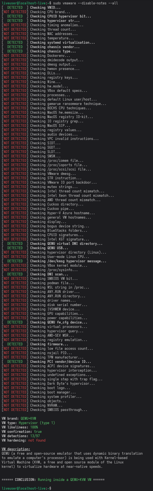

<div align="center">
   
   <br>
   
   
   
   <a href="https://deepwiki.com/NotRequiem/VMAware"></a>
   <br><br>
   <b>VMAware</b> (VM + Aware) is a cross-platform C++ framework for virtual machine detection.
   <br><br>
   <a href="README_CN.md">中文 🇨🇳</a> | <a href="README_FR.md">Français 🇫🇷</a> | <a href="README_KR.md">한국어 🇰🇷</a> | <a href="README_RU.md">Русский 🇷🇺</a>
</div>

- - -

The library is:
- Very easy to use
- Cross-platform (Windows + MacOS + Linux)
- Multi-architecture compatible (amd64, arm64, armhf, armel, i386, mips64el, ppc64el, riscv64, s390x)
- Equipped with around 90 unique VM detection techniques [[list](https://github.com/NotRequiem/VMAware/blob/main/docs/documentation.md#flag-table)]
- Built with the most cutting-edge techniques
- Capable of detecting around 70 VM brands, including VMware, VirtualBox, QEMU, Hyper-V, and many more [[list](https://github.com/NotRequiem/VMAware/blob/main/docs/documentation.md#brand-table)]
- Able to beat VM hardeners
- Very flexible, with fine-grained control over which techniques get executed
- Capable of detecting various VM and semi-VM technologies, including hypervisors, emulators, containers, sandboxes, and more
- Memoized, meaning past results are cached and retrieved if ran again for performance benefits 
- Available with C++11 and above
- Backed by an ecosystem of ports to other languages such as Rust, JavaScript, and Ruby
- Header-only
- Free of any external dependencies
- Fully MIT-licensed, allowing unrestricted use and distribution

<br>

> [!NOTE]
> We are looking for translators willing to translate this README into your native language. If you'd like to contribute, feel free to give us a PR! 

## Example 🧪
```cpp
#include "vmaware.hpp"
#include <iostream>

int main() {
    if (VM::detect()) {
        std::cout << "Virtual machine detected!" << "\n";
    } else {
        std::cout << "Running on baremetal" << "\n";
    }

    std::cout << "VM name: " << VM::brand() << "\n";
    std::cout << "VM type: " << VM::type() << "\n";
    std::cout << "VM certainty: " << (int)VM::percentage() << "%" << "\n";
    std::cout << "VM hardening: " << (VM::is_hardened() ? "likely" : "not found") << "\n";
}
```

Possible output:
```
Virtual machine detected!
VM name: VirtualBox
VM type: Hypervisor (type 2)
VM certainty: 100%
VM hardening: not found
```

<br>

## Structure ⚙️

<p align="center">

<br>
</p>

<br>

## CLI tool 🔧
This project also provides a handy CLI tool utilising the full potential of what the library can do. It also has cross-platform support.

Below is an example of a basic QEMU system with no hardening modifications on Linux.



<!-- Try it out on [Compiler Explorer](https://godbolt.org/z/4sKa1sqrW)!-->

<br>

## Installation 📥
To install the library, download the `vmaware.hpp` file in the latest [release section](https://github.com/NotRequiem/VMAware/releases/latest) to your project. The binaries are also located there. No CMake or shared object linkages are necessary, it's literally that simple.

However, if you want the full project (globally accessible headers with <vmaware.hpp> and the CLI tool), follow these commands:
```bash
git clone https://github.com/NotRequiem/VMAware 
cd VMAware
```

### FOR LINUX:
```bash
sudo dnf/apt/yum update -y # change this to whatever your distro is
mkdir build
cd build
cmake ..
sudo make install
```

### FOR MACOS:
```bash
mkdir build
cd build
cmake ..
sudo make install
```

### FOR WINDOWS:
```bash
cmake -S . -B build/ -G "Visual Studio 16 2019"
```

Optionally, you can create a debug build by appending `-DCMAKE_BUILD_TYPE=Debug` to the cmake arguments.

<br>

### CMake installation
```cmake
# edit this
set(DIRECTORY "/path/to/your/directory/")

set(DESTINATION "${DIRECTORY}vmaware.hpp")

if (NOT EXISTS ${DESTINATION})
    message(STATUS "Downloading VMAware")
    set(URL "https://github.com/NotRequiem/VMAware/releases/latest/download/vmaware.hpp")
    file(DOWNLOAD ${URL} ${DESTINATION} SHOW_PROGRESS)
else()
    message(STATUS "VMAware already downloaded, skipping")
endif()
```

The module file and function version is located [here](auxiliary/vmaware_download.cmake)


<br>

## Documentation and code overview 📒
You can view the full docs [here](docs/documentation.md). All the details such as functions, techniques, settings, and examples are provided. Trust me, it's not too intimidating ;)

If you want to have a general concept of our architecture, head over to https://deepwiki.com/NotRequiem/VMAware.

Information described in DeepWiki or other non official sources may not be accurate.

<br>


## Ports to other languages 🔀

VMAware also has support for a variety of languages, if C++ isn't the language you're looking for then please refer to this list below. All of these projects are officially referred to by the VMAware developers.

| Language | Repository | Details | Author |
|:---------|:---------------:|:--------:|:------:|
|  Ruby | [link](https://github.com/NotRequiem/VMAware/tree/main/gem) | Official Ruby port embedded in the VMAware repository. Windows is not supported. | [Adam Ruman](https://github.com/addam128) |
|  JS | [link](https://github.com/Kyun-J/node-vm-detect) | Very good API, actively maintained. | [Kyun-J](https://github.com/Kyun-J) |
|  Rust | [link](https://github.com/MarcelDev/vmaware-rs) | Very good API, well tested, actively maintained | [Marcel](https://github.com/MarcelDev) |

> [!WARNING]
> Although unofficial ports exists, they are not tried and tested compared to our official ones. Use them at your own risk.

<br>

## Q&A ❓

<details>
<summary>How does it work?</summary>
<br>

> It utilises a comprehensive list of low-level and high-level anti-VM techniques that gets accounted in a scoring system. The scores (0-100) for each technique are given based on an objective criteria focused on detecting the most stealthy VMs by minimizing false positives as much as possible, and every technique that has detected a VM will have their score added to a single accumulative point, where a threshold point number will decide whether it's actually running in a VM.

</details>

<details>
<summary>Who is this library for and what are the use cases?</summary>
<br>

> It's designed for security researchers, VM engineers, anticheat developers, and pretty much anybody who needs a practical and rock-solid VM detection mechanism in their project. The library is useful for malware analysts testing the concealment of their VMs and for proprietary software developers aiming to protect their applications from reverse engineering. It's an effective tool to benchmark how well a VM can hide itself from detection.
> 
> Additionally, software could adjust the behaviour of their program based on the detected environment. It could be useful for debugging purposes, while system administrators could manage configurations differently. Finally, some applications might want to legally restrict usage in VMs as a license clause to prevent unauthorized distribution or testing.

</details>

<details>
<summary>Why another VM detection project?</summary>
<br>

> There's already loads of projects that have the same goal such as 
<a href="https://github.com/CheckPointSW/InviZzzible">InviZzzible</a>, <a href="https://github.com/a0rtega/pafish">pafish</a> and <a href="https://github.com/LordNoteworthy/al-khaser">Al-Khaser</a>. The difference between the aforementioned projects is that they don't provide a programmable interface to interact with the detection mechanisms, on top of having little to no support for non-Windows systems. Additionally, the VM detections in all those projects are often not sophisticated enough to be practically applied to real-world scenarios. An additional hurdle is that they are all GPL projects, so using them for proprietary projects (which would be the main audience for such a functionality), is out of the question. Pafish and InviZzzible have been abandoned for years.
> 
> While those projects have been useful to VMAware to some extent, we wanted to make them far better. Our goal was to make the detection techniques to be accessible programmatically in a cross-platform and flexible way for everybody to get something useful out of it rather than providing just a CLI tool. In summary, this is a VM detection framework that focuses on practical and realistic usability for any scenario, aiming to provide the most accurate result of the environment where your software is running under.

</details>

<details>
<summary>Wouldn't it make it inferior for having the project open source?</summary>
<br>

> VMAware is fully open source, which makes the job of bypassers easier compared to having it closed source. However, We'd argue that's a worthy tradeoff by having as many VM detection techniques in an open and interactive manner. It means we can have valuable community feedback to strengthen the library more effectively and accurately through discussions, collaborations, and competition against anti-anti-vm projects and malware analysis tools which try to hide their presence. 
> 
> All of this combined has further advanced the forefront innovations in the field of VM detections much more productively, compared to having it closed source. In other words, it's about better quality AND quantity, better feedback, and better openness over security through obfuscation. It's the same reason why OpenSSH, OpenSSL, the Linux kernel, and other security-based software projects are relatively secure because of how there's more people helping to make it better compared to people trying to probe the source code with malicious intent. VMAware has this philosophy, and if you know anything about security, you should be familiar with the phrase: "Security through obfuscation is NOT security".

</details>


<details>
<summary>How effective are VM hardeners against the lib?</summary>
<br>

> Publicly known hardeners are not effective and most of them on Windows have been beaten, but this doesn't mean that the lib is immune to them. Custom hardeners that we may not be aware of might have a theoretical advantage, but they are substantially more difficult to produce.
> 
> We continously track both open and closed source projects and bypasses to detect them. Windows is the most targeted operating system for bypassing VM detections, so our main focus is to strengthen detections for this platform.
>
> Currently, no public repository, project or code base in general is able to fully bypass on Windows. When a working public bypass is found, it usually gets fixed in a couple of days. Our arms race is mostly battled against private methods gatekept by cheaters to bypass both VMAware and anti-cheats.

</details>


<details>
<summary>How is it developed?</summary>
<br>

> By researching, we identify the methods currently used to hide VMs and investigate generic detection techniques capable of detecting those methods.
>
> Once we have production-ready code, we upload it to this repository and begin experimental testing in real environments. All code in any github branch is experimental, while the latest release represent our stable code.
>
> Some products that use our project run our library on thousands of systems, collaborating with us to report back how VMAware behaved in such systems. All those reports are manually checked by us for false positives or any other problem in general.
>
> While techniques are evaluated, scores for those techniques are dynamically adjusted based on their effectiveness, reliability, and how they operate together with other detection techniques. The criteria used to put our scores can be found [here](docs/score_system.md).
>
> Using GitHub Actions, we automatically monitor if both compilation and runtime problems occur in every platform we target, each time a new commit is uploaded to our repository.
>
> When the library has accumulated enough changes under our view, we publish a release and explain those changes in detail. Before releasing, we do a security audit to ensure the new published version is safe.

</details>


<details>
<summary>What about using this for malware?</summary>
<br>

> This project is not soliciting the development of malware for obvious reasons. Even if you intend to use it for concealment purposes, it'll most likely be flagged by antiviruses anyways and nothing is obfuscated to begin with. 
>
> We do not intentionally develop the library to try to stop or avoid EDR flags, such as using direct/indirect syscalling, inline hooking detection, and any other kind of malware evasion technique not related to virtualization detection.

</details>


<details>
<summary>Is a kernel-mode component planned to be developed?</summary>
<br>

> No. A kernel-component would require serious auditing. It would also be a dead end for VM bypassing, so it's not fun >:(.
>
> In our opinion, there are also no good user-mode solutions for VM detection, and we want to cover this demand. We can still detect most stealthy virtualised environments while being completely user-mode. 

</details>


<details>
<summary>Is it thread-safe?</summary>
<br>

> No. Don't call this library with multiple threads simultaneously, we don't take more than 1s to run.

</details>


<details>
<summary>How can I compile VMAware for older versions of Windows?</summary>
<br>

> By default, VMAware targets Windows 10-11 when compiling for Windows. 
> 
> If you want to compile for older Windows versions, you just need to tell us the target platform that you want to compile the library for with a Windows preprocessor definition.
> 
> For example, if you want to compile VMAware for Windows 7, add `#define _WIN32_WINNT _WIN32_WINNT_WIN7` at the top of vmaware.hpp. Note that in older Windows terminals, ANSI colors are not supported, but you can run the CLI with the `--no-ansi` argument.
> 
> Older versions than Windows 7 are NOT supported.

</details>


<details>
<summary>I have linker errors when compiling</summary>
<br>

> If you're compiling with gcc or clang, add the <code>-lm</code> and <code>-lstdc++</code> flags, or use g++/clang++ compilers instead. If you're receiving linker errors from a brand new VM environment on Linux, update your system with `sudo apt/dnf/yum update -y` to install the necessary C++ components.

</details>

<br>

## Issues, discussions, pull requests, and inquiries 📬
If you have any suggestions, ideas, or any sort of contribution, feel free to ask! I'll be more than happy to discuss either in the [issue](https://github.com/NotRequiem/VMAware/issues) or [discussion](https://github.com/NotRequiem/VMAware/discussions) sections. If you want to personally ask something in private, contact `shenzken` on Discord.

For email inquiries: `vmaware.support@gmail.com`

<br>

## Credits, contributors, and acknowledgements ✒️

<a href="https://github.com/NotRequiem/VMAware/graphs/contributors">
  
</a>

<br>

- [Requiem](https://github.com/NotRequiem) (Main developer)
- [kernelwernel](https://github.com/kernelwernel) (Former creator and developer of the project)
- [Check Point Research](https://research.checkpoint.com/)
- [Unprotect Project](https://unprotect.it/)
- [Al-Khaser](https://github.com/LordNoteworthy/al-khaser)
- [pafish](https://github.com/a0rtega/pafish)
- [Matteo Malvica](https://www.matteomalvica.com)
- N. Rin, EP_X0FF
- [Peter Ferrie, Symantec](https://github.com/peterferrie)
- [Graham Sutherland, LRQA Nettitude](https://www.nettitude.com/uk/)
- [Alex](https://github.com/greenozon)
- [Marek Knápek](https://github.com/MarekKnapek)
- [Vladyslav Miachkov](https://github.com/fameowner99)
- [(Offensive Security) Danny Quist](chamuco@gmail.com)
- [(Offensive Security) Val Smith](mvalsmith@metasploit.com)
- Tom Liston + Ed Skoudis
- [Tobias Klein](https://www.trapkit.de/index.html)
- [(S21sec) Alfredo Omella](https://www.s21sec.com/)
- [hfiref0x](https://github.com/hfiref0x)
- [Waleedassar](http://waleedassar.blogspot.com)
- [一半人生](https://github.com/TimelifeCzy)
- [Thomas Roccia (fr0gger)](https://github.com/fr0gger)
- [systemd project](https://github.com/systemd/systemd)
- mrjaxser
- [iMonket](https://github.com/PrimeMonket)
- Eric Parker's discord community 
- [ShellCode33](https://github.com/ShellCode33)
- [Georgii Gennadev (D00Movenok)](https://github.com/D00Movenok)
- [utoshu](https://github.com/utoshu)
- [Jyd](https://github.com/jyd519)
- [git-eternal](https://github.com/git-eternal)
- [dmfrpro](https://github.com/dmfrpro)
- [Teselka](https://github.com/Teselka)
- [Kyun-J](https://github.com/Kyun-J)
- [luukjp](https://github.com/luukjp)
- [Randark](https://github.com/Randark-JMT)
- [Scrut1ny](https://github.com/Scrut1ny)
- [Lorenzo Rizzotti (Dreaming-Codes)](https://github.com/Dreaming-Codes)
- [virtfunc](https://github.com/virtfunc)
- [Adam Ruman](https://github.com/addam128)
- [Juan Diego](https://github.com/w451)
- [Wiisus](https://github.com/wiisus)
- [Marcel](https://github.com/MarcelDev)
- [Max Ufer](https://github.com/Manny684)
- [Everdox](https://github.com/everdox)
- [snackapps](https://github.com/snackapps)
 
<br>

## Legal 📜
I am not responsible nor liable for any damage you cause through any malicious usage of this project. 

License: MIT
