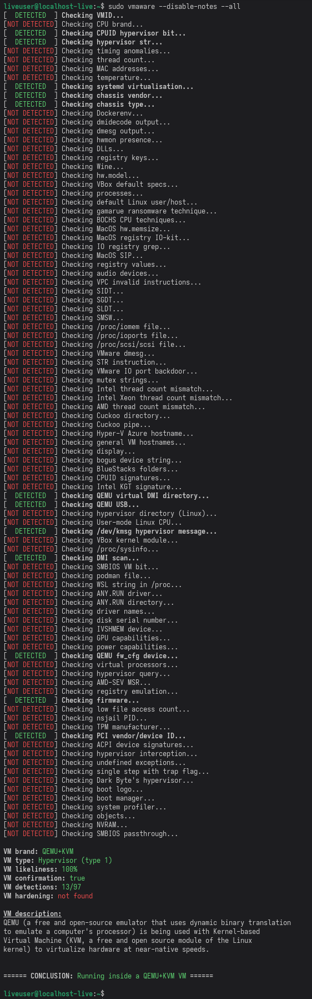

<div align="center">
   
   <br>
   
   
   <br><br>
   <b>VMAware</b> (VM + Aware) — это кроссплатформенный C++ фреймворк для обнаружения виртуальных машин.
   <br><br>
   <a href="README.md">English 🇬🇧</a> | <a href="README_CN.md">中文 🇨🇳</a> | <a href="README_FR.md">Français 🇫🇷</a> | <a href="README_KR.md">한국어 🇰🇷</a>
</div>

- - -

Библиотека:
- Очень проста в использовании
- Кроссплатформенная (Windows + MacOS + Linux)
- Поддерживает множество архитектур (alpha, amd64, arm64, arm64ec, armel, armhf, hppa, i386, m68k, mips, mipsel, mips64, mips64el, powerpc, ppc64, ppc64el, riscv64, s390x, sh4, sparc64, x32)
- Оснащена примерно 90 уникальными техниками обнаружения ВМ [[список](https://github.com/NotRequiem/VMAware/blob/main/docs/documentation.md#flag-table)]
- Создана с использованием самых передовых методов
- Способна обнаруживать около 70 марок ВМ, включая VMware, VirtualBox, QEMU, Hyper-V и многие другие [[список](https://github.com/NotRequiem/VMAware/blob/main/docs/documentation.md#brand-table)]
- Способна преодолевать средства защиты (харденинг) ВМ
- Очень гибкая, с тонким контролем над выполняемыми техниками
- Способна обнаруживать различные технологии ВМ и полу-ВМ, включая гипервизоры, эмуляторы, контейнеры, песочницы и др.
- Мемоизирована, то есть прошлые результаты кэшируются и извлекаются при повторном запуске для повышения производительности
- Доступна для C++11 и выше
- Поддерживается экосистемой портов на другие языки, такие как JavaScript и Ruby
- Header-only (состоит только из заголовочного файла)
- Не содержит внешних зависимостей
- Полностью лицензирована под MIT, допускает неограниченное использование и распространение

<br>

## Пример 🧪
```cpp
#include "vmaware.hpp"
#include <iostream>

int main() {
    if (VM::detect()) {
        std::cout << "Virtual machine detected!" << "\n";
    } else {
        std::cout << "Running on bare metal" << "\n";
    }

    std::cout << "VM name: " << VM::brand() << "\n";
    std::cout << "VM type: " << VM::type() << "\n";
    std::cout << "VM certainty: " << (int)VM::percentage() << "%" << "\n";
}
```

Возможный вывод:
```
Virtual machine detected!
VM name: VirtualBox
VM type: Hypervisor (type 2)
VM certainty: 100%
```

<br>

## Структура ⚙️

<p align="center">

<br>
</p>

<br>

## CLI-утилита 🔧
Этот проект также предоставляет удобную CLI-утилиту, использующую весь потенциал библиотеки. Она также кроссплатформенная.

Ниже приведён пример базовой системы QEMU без модификаций защиты на Linux.



<!-- Try it out on [Compiler Explorer](https://godbolt.org/z/4sKa1sqrW)!-->

<br>

## Установка 📥
Чтобы установить библиотеку, скачайте файл `vmaware.hpp` из последнего [раздела релизов](https://github.com/NotRequiem/VMAware/releases/latest) в ваш проект. Бинарные файлы также находятся там. Никаких CMake или связываний разделяемых объектов не требуется — всё действительно так просто.

Однако, если вам нужен полный проект (глобально доступные заголовки с `<vmaware.hpp>` и CLI-утилита), выполните следующие команды:
```bash
git clone https://github.com/NotRequiem/VMAware 
cd VMAware
```

### ДЛЯ LINUX:
```bash
sudo dnf/apt/yum update -y # замените на команду вашего дистрибутива
mkdir build
cd build
cmake ..
sudo make install
```

### ДЛЯ MACOS:
```bash
mkdir build
cd build
cmake ..
sudo make install
```

### ДЛЯ WINDOWS:
```bash
cmake -S . -B build/ -G "Visual Studio 16 2019"
```

При желании вы можете создать отладочную сборку, добавив `-DCMAKE_BUILD_TYPE=Debug` к аргументам cmake.

<br>

### Установка через CMake
```cmake
# edit this
set(DIRECTORY "/path/to/your/directory/")

set(DESTINATION "${DIRECTORY}vmaware.hpp")

if (NOT EXISTS ${DESTINATION})
    message(STATUS "Downloading VMAware")
    set(URL "https://github.com/NotRequiem/VMAware/releases/latest/download/vmaware.hpp")
    file(DOWNLOAD ${URL} ${DESTINATION} SHOW_PROGRESS)
else()
    message(STATUS "VMAware already downloaded, skipping")
endif()
```

Файл модуля и версия функции находятся [здесь](auxiliary/vmaware_download.cmake)

<br>

## Документация и обзор кода 📒
Вы можете ознакомиться с полной документацией [здесь](docs/documentation.md). 

Здесь приведены все подробности: функции, техники, настройки и примеры. Поверьте, это не так страшно ;)

<br>

## Порты на другие языки 🔀

VMAware также поддерживает различные языки. Если C++ — не тот язык, который вы ищете, обратитесь к списку ниже. Все эти проекты официально поддерживаются разработчиками VMAware.

| Язык | Репозиторий | Подробности | Автор |
|:---------|:---------------:|:--------:|:------:|
|  Ruby | [ссылка](https://github.com/NotRequiem/VMAware/tree/main/gem) | Официальный порт на Ruby, встроенный в репозиторий VMAware. Windows не поддерживается. | [Adam Ruman](https://github.com/addam128) |
|  JS | [ссылка](https://github.com/Kyun-J/node-vm-detect) | Отличный API, активно поддерживается. | [Kyun-J](https://github.com/Kyun-J) |

> [!WARNING]
> Хотя неофициальные порты существуют, они не тестируются по сравнению с нашими официальными. Используйте их на свой страх и риск.

<br>

## Q&A ❓

<details>
<summary>Как это работает?</summary>
<br>

> Фреймворк использует обширный список низкоуровневых и высокоуровневых анти-VM техник, учитываемых в системе баллов. Баллы (0–100) для каждой техники назначаются на основе объективных критериев, направленных на обнаружение самых скрытных ВМ при максимальном снижении ложных срабатываний. Каждая техника, обнаружившая ВМ, добавляет свои баллы к общему накопительному счёту, а пороговое значение баллов определяет, действительно ли система работает в ВМ.

</details>

<details>
<summary>Для кого предназначена эта библиотека и каковы варианты её использования?</summary>
<br>

> Она разработана для исследователей безопасности, инженеров ВМ, разработчиков античитов и практически всех, кому нужен практичный и надёжный механизм обнаружения ВМ в своём проекте. Библиотека полезна аналитикам вредоносного ПО, проверяющим скрытность своих ВМ, и разработчикам проприетарного ПО, стремящимся защитить свои приложения от реверс-инжиниринга. Это эффективный инструмент для оценки того, насколько хорошо ВМ способна скрыться от обнаружения.
> 
> Кроме того, программное обеспечение может изменять своё поведение в зависимости от обнаруженного окружения. Это может пригодиться для целей отладки, а системные администраторы могут гибко управлять конфигурациями. Наконец, некоторые приложения могут юридически ограничивать использование в ВМ с помощью лицензионного соглашения для предотвращения несанкционированного распространения или тестирования.

</details>

<details>
<summary>Зачем ещё один проект обнаружения ВМ?</summary>
<br>

> Уже существует множество проектов с той же целью, например 
<a href="https://github.com/CheckPointSW/InviZzzible">InviZzzible</a>, <a href="https://github.com/a0rtega/pafish">pafish</a> и <a href="https://github.com/LordNoteworthy/al-khaser">Al-Khaser</a>. Разница с вышеупомянутыми проектами заключается в том, что они не предоставляют программного интерфейса для взаимодействия с механизмами обнаружения, а также практически не поддерживают системы кроме Windows. Кроме того, обнаружение ВМ во всех этих проектах зачастую недостаточно совершенно для практического применения в реальных условиях. Дополнительным препятствием является то, что все они распространяются под лицензией GPL, поэтому их использование в проприетарных проектах (главной целевой аудитории для такого функционала) исключено. Pafish и InviZzzible заброшены годами.
> 
> Хотя эти проекты в определённой степени были полезны для VMAware, мы хотели сделать их гораздо лучше. Наша цель заключалась в том, чтобы сделать техники обнаружения программно доступными, кроссплатформенными и гибкими, чтобы каждый мог извлечь из них пользу, а не просто получить CLI-утилиту. В итоге, это фреймворк для обнаружения ВМ, ориентированный на практическое и реалистичное применение в любом сценарии, целью которого является предоставление наиболее точного результата об окружении, в котором работает ваше ПО.

</details>

<details>
<summary>Не делает ли открытый исходный код проект хуже?</summary>
<br>

> VMAware полностью открыт, что облегчает задачу создателям обходов по сравнению с закрытым кодом. Однако мы считаем это оправданным компромиссом ради максимального количества техник обнаружения ВМ в открытом и интерактивном формате. Это означает, что мы можем получать ценные отзывы сообщества для более эффективного и точного усиления библиотеки через обсуждения, сотрудничество и соревнование с проектами anti-anti-VM и инструментами анализа вредоносного ПО, пытающимися скрыть своё присутствие.
> 
> Всё это вместе взятое продвинуло передовые инновации в области обнаружения ВМ гораздо продуктивнее, чем в случае закрытого кода. Иными словами, речь идёт о более высоком качестве И количестве, лучшей обратной связи и большей открытости вместо безопасности через обфускацию. По той же причине OpenSSH, OpenSSL, ядро Linux и другие ориентированные на безопасность проекты относительно безопасны: людей, помогающих их улучшать, больше, чем тех, кто пытается исследовать исходный код со злым умыслом. VMAware придерживается этой философии, и если вы хоть немного разбираетесь в безопасности, вам знакома фраза: «Безопасность через обфускацию — это НЕ безопасность».

</details>

<details>
<summary>Насколько эффективны средства защиты (харденинг) ВМ против библиотеки?</summary>
<br>

> Публично известные средства харденинга неэффективны, и большинство из них на Windows уже побеждены, но это не означает, что библиотека неуязвима для них. Кастомные средства защиты, о которых мы можем не знать, могут иметь теоретическое преимущество, но их создание значительно сложнее.
> 
> Мы непрерывно отслеживаем как открытые, так и закрытые проекты и методы обхода, чтобы обнаруживать их. Windows является наиболее популярной ОС для обхода обнаружения ВМ, поэтому наш основной фокус направлен на усиление детектов для этой платформы.
> 
> В настоящее время ни один публичный репозиторий, проект или база кода в целом не способны полностью обойти детекты на Windows. Когда обнаруживается рабочий публичный обход, он обычно исправляется за пару дней. Наша гонка вооружений в основном ведётся против приватных методов, скрываемых читерами для обхода как VMAware, так и античитов.

</details>

<details>
<summary>Как разрабатывается проект?</summary>
<br>

> С помощью исследований мы выявляем методы, используемые в настоящее время для сокрытия ВМ, и исследуем общие техники обнаружения, способные выявлять эти методы.
> 
> Как только у нас появляется готовый к продакшену код, мы загружаем его в этот репозиторий и начинаем экспериментальное тестирование в реальных окружениях. Любой код в любой ветке GitHub является экспериментальным, тогда как последний релиз представляет наш стабильный код.
> 
> Некоторые продукты, использующие наш проект, запускают нашу библиотеку на тысячах систем, сотрудничая с нами и сообщая о том, как VMAware вела себя на этих системах. Все эти отчёты проверяются нами вручную на предмет ложных срабатываний или любых других проблем в целом.
> 
> В ходе оценки техник баллы для них динамически корректируются в зависимости от их эффективности, надёжности и того, как они работают в сочетании с другими техниками обнаружения. Критерии, используемые для выставления баллов, можно найти [здесь](docs/score_system.md).
> 
> С помощью GitHub Actions мы автоматически отслеживаем возникновение проблем компиляции и времени выполнения на каждой целевой платформе при каждой загрузке нового коммита в наш репозиторий.
> 
> Когда библиотека накапливает достаточно изменений, по нашему мнению, мы публикуем релиз и подробно описываем эти изменения. Перед выпуском релиза мы проводим аудит безопасности, чтобы убедиться в надёжности публикуемой версии.

</details>

<details>
<summary>Что насчёт использования для вредоносного ПО?</summary>
<br>

> Этот проект не поощряет разработку вредоносного ПО по понятным причинам. Даже если вы намерены использовать его для скрытности, он, скорее всего, всё равно будет заблокирован антивирусами, к тому же код изначально не обфусцирован.
> 
> Мы намеренно не разрабатываем библиотеку для попыток обхода или предотвращения срабатываний EDR, таких как использование прямых/косвенных системных вызовов (syscalls), обнаружение инлайн-хуков и любых других техник уклонения вредоносных программ, не связанных с обнаружением виртуализации.

</details>

<details>
<summary>Планируется ли разработка компонента уровня ядра?</summary>
<br>

> Нет. По нашему мнению, не существует хороших решений пользовательского режима для обнаружения ВМ, и мы хотим посвятить всё наше время удовлетворению этой потребности. Мы всё ещё можем обнаруживать самые скрытные виртуализированные среды, полностью оставаясь в пользовательском режиме. 

</details>

<details>
<summary>Потокобезопасна ли библиотека?</summary>
<br>

> Нет. Не вызывайте функции этой библиотеки из нескольких потоков одновременно — выполнение занимает не более 1 секунды.

</details>

<details>
<summary>У меня возникают ошибки линковки при компиляции</summary>
<br>

> Если вы компилируете с помощью gcc или clang, добавьте флаги <code>-lm</code> и <code>-lstdc++</code> или используйте компиляторы g++/clang++. Если вы получаете ошибки линковщика в совершенно новой среде ВМ на Linux, обновите систему с помощью `sudo apt/dnf/yum update -y`, чтобы установить необходимые компоненты C++.

</details>

<br>

## Вопросы, обсуждения, пул-реквесты и запросы 📬
Если у вас есть предложения, идеи или вы хотите внести вклад — смело обращайтесь! Мы будем рады всё обсудить в разделах [issues](https://github.com/NotRequiem/VMAware/issues) или [discussions](https://github.com/NotRequiem/VMAware/discussions). Если вы хотите спросить что-то лично в приватном порядке, свяжитесь с `shenzken` в Discord.

По электронной почте: `vmaware.support@gmail.com`

<br>

## Авторы, участники и благодарности ✒️

<a href="https://github.com/NotRequiem/VMAware/graphs/contributors">
  
</a>

<br>

- [Requiem](https://github.com/NotRequiem) (Main developer)
- [kernelwernel](https://github.com/kernelwernel) (Former creator and developer of the project)
- [Check Point Research](https://research.checkpoint.com/)
- [Unprotect Project](https://unprotect.it/)
- [Al-Khaser](https://github.com/LordNoteworthy/al-khaser)
- [pafish](https://github.com/a0rtega/pafish)
- [Matteo Malvica](https://www.matteomalvica.com)
- N. Rin, EP_X0FF
- [Peter Ferrie, Symantec](https://github.com/peterferrie)
- [Graham Sutherland, LRQA Nettitude](https://www.nettitude.com/uk/)
- [Alex](https://github.com/greenozon)
- [Marek Knápek](https://github.com/MarekKnapek)
- [Vladyslav Miachkov](https://github.com/fameowner99)
- [(Offensive Security) Danny Quist](chamuco@gmail.com)
- [(Offensive Security) Val Smith](mvalsmith@metasploit.com)
- Tom Liston + Ed Skoudis
- [Tobias Klein](https://www.trapkit.de/index.html)
- [(S21sec) Alfredo Omella](https://www.s21sec.com/)
- [hfiref0x](https://github.com/hfiref0x)
- [Waleedassar](http://waleedassar.blogspot.com)
- [一半人生](https://github.com/TimelifeCzy)
- [Thomas Roccia (fr0gger)](https://github.com/fr0gger)
- [systemd project](https://github.com/systemd/systemd)
- mrjaxser
- [iMonket](https://github.com/PrimeMonket)
- Eric Parker's discord community 
- [ShellCode33](https://github.com/ShellCode33)
- [Georgii Gennadev (D00Movenok)](https://github.com/D00Movenok)
- [utoshu](https://github.com/utoshu)
- [Jyd](https://github.com/jyd519)
- [git-eternal](https://github.com/git-eternal)
- [dmfrpro](https://github.com/dmfrpro)
- [Teselka](https://github.com/Teselka)
- [Kyun-J](https://github.com/Kyun-J)
- [luukjp](https://github.com/luukjp)
- [Randark](https://github.com/Randark-JMT)
- [Scrut1ny](https://github.com/Scrut1ny)
- [Lorenzo Rizzotti (Dreaming-Codes)](https://github.com/Dreaming-Codes)
- [virtfunc](https://github.com/virtfunc)
- [Adam Ruman](https://github.com/addam128)
- [Juan Diego](https://github.com/w451)
- [Wiisus](https://github.com/wiisus)
- [Marcel](https://github.com/MarcelDev)
- [Max Ufer](https://github.com/Manny684)
- [Everdox](https://github.com/everdox)
- [snackapps](https://github.com/snackapps)
- [Bandwidth](https://github.com/bandw1dth)
 
<br>

## Юридическая информация 📜
Вы несёте единоличную ответственность за использование данного репозитория и за обеспечение соответствия вашего использования применимому законодательству, нормативным актам, а также условиям любых сторонних систем, сервисов, учётных записей или данных, с которыми вы взаимодействуете.

Публикация этого репозитория или любые ссылки на сторонние продукты, сервисы, наименования или товарные знаки не подразумевают какого-либо одобрения или поддержки.

Стороннее программное обеспечение, модели, наборы данных, исполняемые файлы и другие материалы, включённые в данный репозиторий или упоминаемые в нём, остаются объектом их собственных лицензий и условий. Вы несёте ответственность за ознакомление с этими отдельными условиями и их соблюдение.


Лицензия: MIT